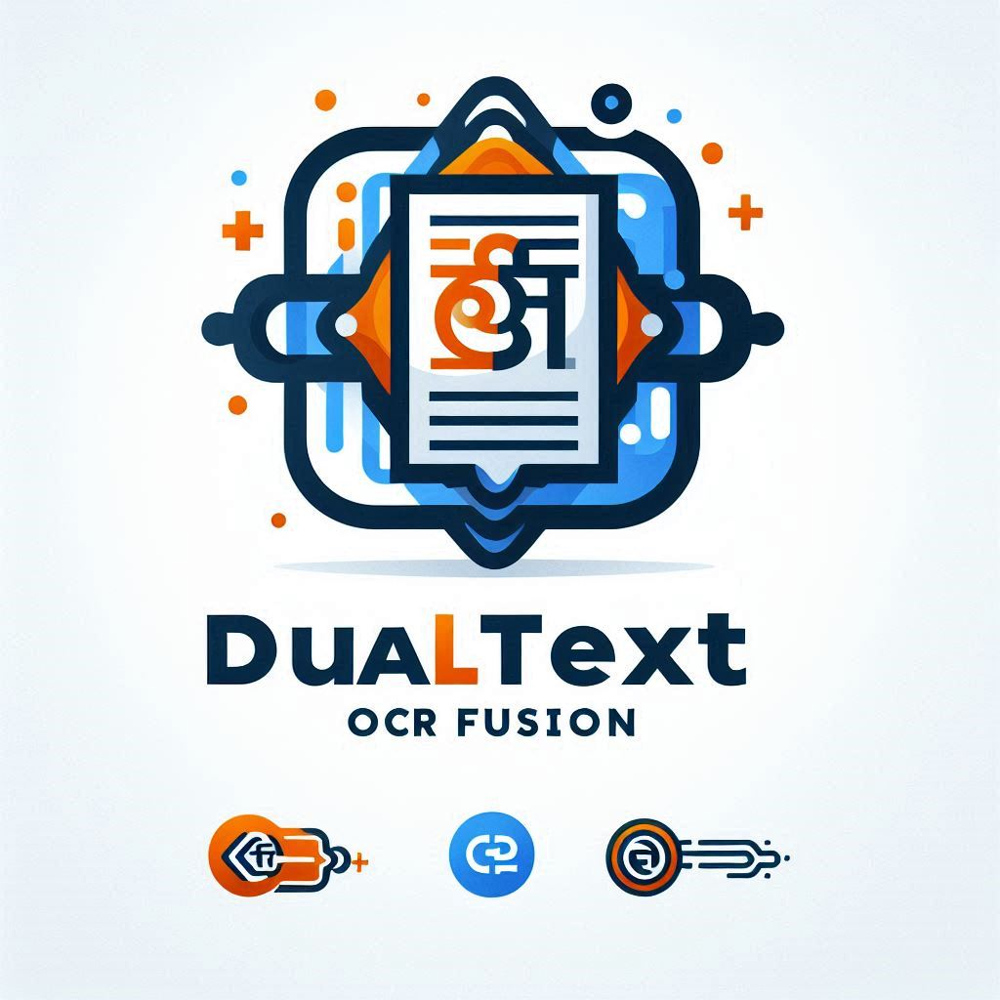
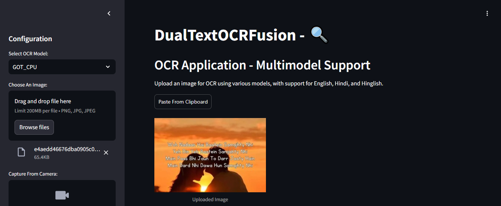
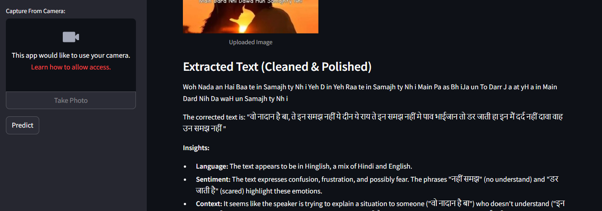

# 🔍 DualTextOCRFusion


**DualTextOCRFusion** is a web-based Optical Character Recognition (OCR) application that allows users to upload images, extract text, and search for keywords within the extracted text. The app uses models like **Byaldi + Qwen2-VL** or **General OCR Theory (GOT)** for multilingual text extraction.

## Features

- **Multilingual OCR**: Extract text from images containing both **Hindi** and **English**.
- **Keyword Search**: Search for specific keywords in the extracted text in real-time.
- **Text Correction and Pasting**: Allows pasting images from clipboard and displaying cleaned results.
- **User-Friendly Interface**: Simple, intuitive interface for easy image uploading and searching.

## Technologies Used

- **Python**: Backend logic.
- **Streamlit**: For building the web interface.
- **Huggingface Transformers**: For integrating OCR models (Qwen2-VL or GOT).
- **PyTorch**: For deep learning inference.
- **OpenCV**: For image preprocessing.
- **Pillow**: For handling image data.

## Project Structure

```
DualTextOCRFusion/
│
├── app.py                 # Main Streamlit application
├── requirements.txt       # Dependencies for the project
└── README.md              # This file
```

## How to Run Locally

### Prerequisites

- Python 3.8 or above installed on your machine.

### Steps

1. **Clone the Repository**:

   ```bash
   git clone https://github.com/yourusername/dual-text-ocr-fusion.git
   cd dual-text-ocr-fusion
   ```

2. **Install Dependencies**:

   Install the required dependencies by running:

   ```bash
   pip install -r requirements.txt
   ```

3. **Run the Application**:

   Start the Streamlit app by running the following command:

   ```bash
   streamlit run app.py
   ```

4. **Open the App**:

   Once the server starts, the app will be available in your browser at:

   ```
   http://localhost:8501
   ```

### Usage

1. **Upload an Image**: Upload an image containing Hindi and/or English text in formats like JPG, JPEG, or PNG.
2. **View Extracted Text**: The app will extract and display the text from the image.
3. **Search for Keywords**: Enter any keyword to search within the extracted text in real-time without pressing Enter.

## Customization

### Changing the OCR Model

By default, the app uses the **Qwen2-VL** model, but you can switch to the **General OCR Theory (GOT)** model by modifying the OCR extraction logic in `app.py`.

## Deployment

The app can be deployed using any platform that supports Streamlit apps, such as **Streamlit Community Cloud**, **Heroku**, or **AWS**.

## Example Images

Here are some sample images you can use to test the OCR functionality:

1. **Sample 1**: A document with mixed Hindi and English text.
   

2. **Sample 2**: An image with only Hindi text for multilingual OCR testing.

   

## Dependencies

The main dependencies for the project are:

- `transformers==4.45.0`
- `streamlit==1.30.0`
- `torch` (from PyTorch CPU)
- `Pillow==10.3.0`
- `opencv-python`
- `streamlit-keyup`
- `st-img-pastebutton`

To see the full list of dependencies, refer to the `requirements.txt` file.

## Contributing

If you'd like to contribute to this project, feel free to fork the repository and submit a pull request. Follow these steps:

1. Fork the project.
2. Create a feature branch:

   ```bash
   git checkout -b feature-branch
   ```

3. Commit your changes:

   ```bash
   git commit -am 'Add new feature'
   ```

4. Push to the branch:

   ```bash
   git push origin feature-branch
   ```

5. Open a pull request.

## Screenshot
   
   

## License

This project is licensed under the MIT License - see the [LICENSE](LICENSE) file for details.

## Credits

- **Streamlit**: For the easy-to-use web interface.
- **Huggingface Transformers**: For the powerful OCR models.
- **PyTorch**: For model inference.
- **Byaldi & GOT Models**: For multilingual OCR support.